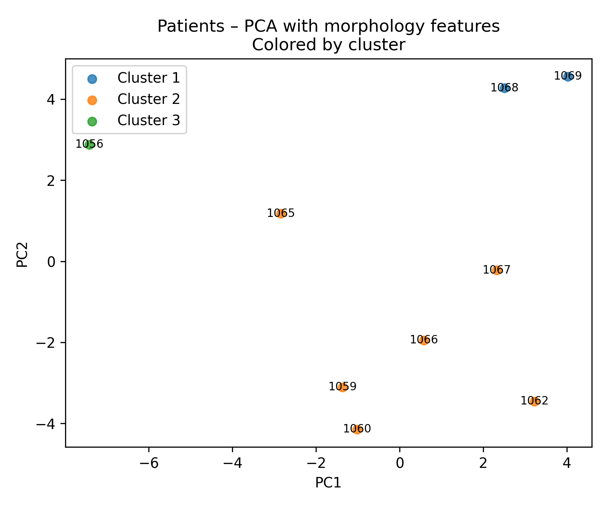
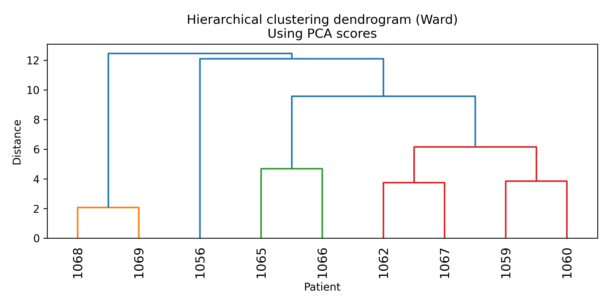
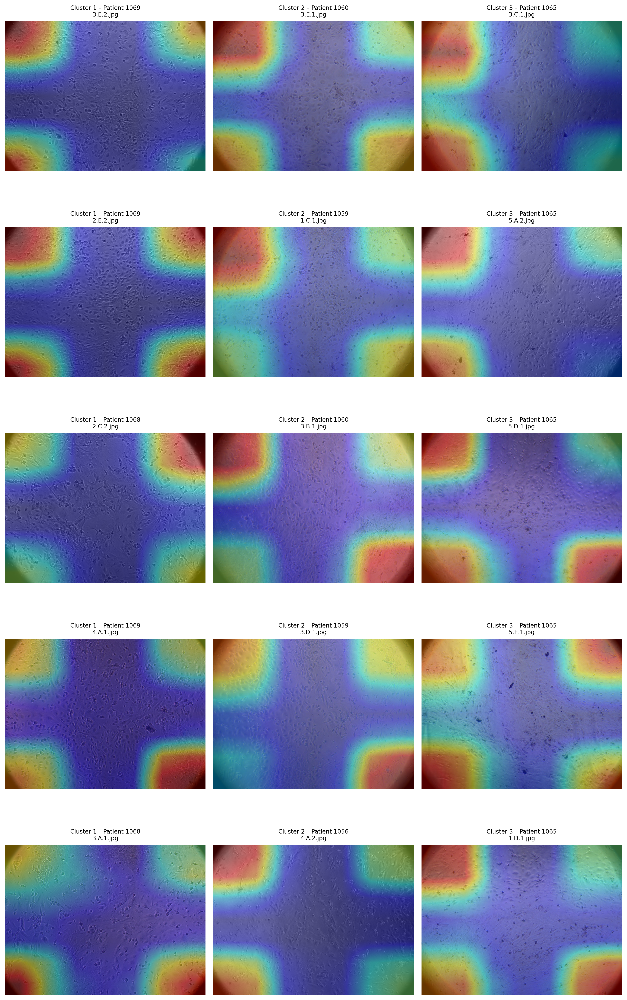

# 🧬 Peritoneal Dialysis – Mesothelial Cell Imaging & Unsupervised Patient Clustering

[](LICENSE)
[](https://www.python.org/)
[](https://novaims.unl.pt)

---

## 🧭 Overview

This repository contains the **full pipeline**, source code, metadata, and documentation used in the analysis of **mesothelial cell images from peritoneal dialysis (PD) patients**.

It supports the complete workflow used in the experiments, covering:

- dataset structuring  
- image preprocessing  
- morphological, intensity, texture, and deep-feature extraction  
- patient-level aggregation  
- PCA & hierarchical clustering  
- representative image selection  
- Grad-CAM interpretability  
- LaTeX-ready tables and figures  

The goal is to ensure **full reproducibility**, transparency, and scientific rigor.

---

## 📁 Repository Structure

```
peritoneal-dialysis-mesothelial-clustering/
│
├── data/
│   ├── raw/                    # Raw microscopy images (NOT uploaded here)
│   ├── intermediate/           # Extracted features by image/patient
│   └── results/                # PCA projections, dendrograms, representative panels
│
├── src/
│   ├── preprocessing/          # Preprocessing + feature extraction
│   ├── aggregation/            # Patient-level aggregation scripts
│   ├── clustering/             # PCA + hierarchical clustering
│   ├── visualization/          # Representative images, Grad-CAM
│   └── latex/                  # Export tables & figures for the text
│   └── figures/                # Figures generated in the experiments
│
├── README.md
├── LICENSE
└── .gitignore
```

---

## ⚙️ Installation

```bash
conda create -n pdmesothelial python=3.10
conda activate pdmesothelial
pip install -r requirements.txt
```

---

## ▶️ Pipeline Execution

### **1. Build dataset index**

```bash
python src/preprocessing/build_data_image.py
python src/preprocessing/prepare_dataset_overview.py
```

### **2. Extract features**

```bash
python src/preprocessing/extract_basic_image_features.py
python src/preprocessing/extract_morphology_features.py
python src/preprocessing/extract_deep_image_features.py
```

### **3. Aggregate patient-level descriptors**

```bash
python src/aggregation/aggregate_features_by_patient.py
python src/aggregation/aggregate_morphology_features.py
python src/aggregation/aggregate_deep_features_by_patient.py
```

### **4. Perform clustering**

```bash
python src/clustering/cluster_patients_pca.py
python src/clustering/cluster_patients_with_morphology.py
python src/clustering/cluster_patients_deep_features.py
python src/clustering/cluster_pca_all_features.py
python src/clustering/analyze_cluster_feature_differences.py
python src/clustering/cluster_clinical_stats.py
python src/clustering/summarize_clusters_with_morphology.py
python src/clustering/summarize_patient_clusters.py
```

### **5. Generate representative panels & Grad-CAM**

```bash
python src/visualization/select_representative_images_by_cluster.py
python src/visualization/panel_representative_images.py
python src/visualization/gradcam_representative_images.py
python src/visualization/panel_gradcam_representative_images.py
python src/visualization/select_representative_images_deep.py
```

### **6. Export LaTeX tables**

```bash
python src/latex/generate_latex_outputs.py
python src/latex/generate_latex_stats.py
python src/latex/generate_figures_latex_data.py
```

---

## 🧠 Features Extracted

### **Basic Image Features (Intensity + Edges)**
- mean, std, min, max intensity  
- Sobel edge magnitude  

### **Morphology Features**
- cell count & density  
- mean & std of:
  - area  
  - eccentricity  
  - aspect ratio  
  - solidity  

### **GLCM Texture**
- contrast  
- homogeneity  
- energy  
- correlation  

### **Deep Learning (CNN / ResNet-50)**
- 2048-d feature vector per image  
- 4096D patient vector (mean + std)

---

## 📊 Outputs Included

- PCA plots (all feature sets)
- clustering dendrograms
- representative image panels
- Grad-CAM maps
- aggregated tables (`.tex`) used in the dissertation
- 
## 🧬 PCA Clustering (Image-only features)



## 🌳 Dendrogram (Ward Linkage)



## 📸 Representative Images


## 🔥 Grad-CAM Interpretability




---

## 🔒 Privacy Notice

This repository is intended to be **private**, as raw human cell images cannot be publicly distributed.  
Only processed features (without identifiable content) should be uploaded.

---

## 📘 Citation

```bibtex
@misc{souza2025pdmesothelial,
  author    = {Paulo Vitor de Campos Souza},
  title     = {Peritoneal Dialysis Mesothelial Cell Imaging: Feature Extraction and Unsupervised Patient Clustering},
  year      = {2025},
}
```

---

## 📬 Contact

Paulo Vitor de Campos Souza  
NOVA Information Management School (NOVA IMS)  
Email: psouza@novaims.unl.pt

Luísa Alexandra Teixeira Santos  
NOVA Medical School 
Email: pluisa.santos@nms.unl.pt

Sofia Pereira  
NOVA Medical School  
Email: sofia.pereira@nms.unl.pt

---

*“Understanding cellular morphology to uncover patient-level patterns in peritoneal dialysis.”*
